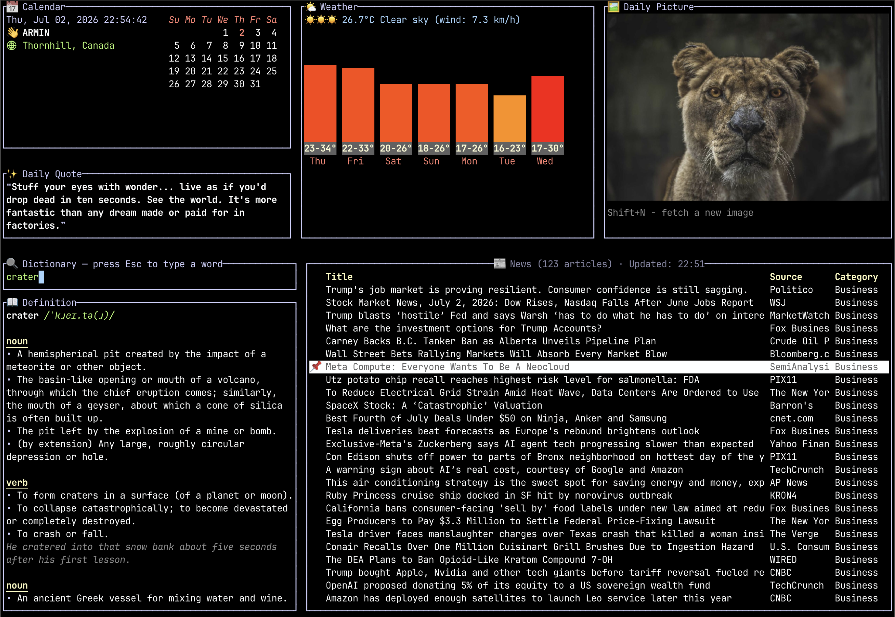

# Daily Dashboard

[](https://github.com/arminv/daily-dashboard/actions/workflows/ci.yml)
[](https://ratatui.rs)
[](LICENSE)

A terminal dashboard you can keep open all day - weather, news, a calendar, a
daily picture, a daily quote, and a built-in dictionary, all in one `ratatui`
screen.



## Features

- **Greeting & clock** - personalized hello, live time, and IP-based geolocation.
- **Calendar** - current month with today highlighted.
- **Weather** - current conditions plus a 7-day forecast bar chart (Open-Meteo).
- **Daily Picture** - a random photo from [Lorem Picsum](https://picsum.photos),
  rendered inline via `ratatui-image` (kitty/iTerm2/sixel, with a
  unicode-halfblocks fallback). Press `Shift+N` to fetch a new image.
- **Daily inspiration** - a fresh quote each day (ZenQuotes).
- **Dictionary** - look up any word and read its definitions inline
  ([Free Dictionary API](https://dictionaryapi.dev)).
- **News feed** - scrollable, categorized headlines; open any article in your
  browser (ok.surf).

No API keys required - every data source is free and public, including the
daily picture (served by [Lorem Picsum](https://picsum.photos), which needs no key
and has no meaningful rate limit).

The daily picture is rendered via `ratatui-image`, which auto-detects your
terminal's graphics protocol (kitty / iTerm2 / sixel) and falls back to unicode
halfblocks. Warp uses the iTerm2 (OSC 1337) inline-image protocol for a sharp,
full-resolution render (it supports iTerm2 images but not Kitty Unicode
placeholders, which would show as `[?]` tofu). The VS Code / Cursor integrated
terminal defaults to halfblocks, because its inline-image support
(`terminal.integrated.enableImages`) is off by default and a graphics protocol
would otherwise render nothing; if you've enabled that setting, set
`DAILY_DASHBOARD_IMAGE_PROTOCOL=iterm2` for a full-resolution image. If a
terminal shows `[?]` boxes instead of the photo, auto-detection picked a protocol
it can't actually render (common inside `tmux`); set
`DAILY_DASHBOARD_IMAGE_PROTOCOL=halfblocks` (works everywhere) or force
`kitty` / `sixel` / `iterm2` / `auto`.

## Quick start

```bash
cargo run
```

## Keybindings

| Key                       | Action                                  |
| ------------------------- | --------------------------------------- |
| `q` / `Ctrl-c` / `Ctrl-d` | Quit                                    |
| `Esc`                     | Enter dictionary search mode            |
| `Enter`                   | Search the typed word (in dictionary)   |
| `i` / `↑`                 | Move news selection up                  |
| `j` / `↓`                 | Move news selection down                |
| `Enter`                   | Open selected article in browser (news) |
| `Shift+N`                 | Fetch a new daily picture               |

Keybindings are configurable in `config.json5` (see `.config/config.json5`).

## Data sources

| Widget        | Source                                           | Refresh             |
| ------------- | ------------------------------------------------ | ------------------- |
| Greeting      | Public IP + `ipgeolocate` (ip-api.com)           | Once                |
| Weather       | [Open-Meteo](https://open-meteo.com)             | 10 minutes          |
| Inspiration   | [ZenQuotes](https://zenquotes.io)                | Daily               |
| Dictionary    | [Free Dictionary API](https://dictionaryapi.dev) | On demand           |
| News          | [ok.surf](https://ok.surf)                       | 30 minutes          |
| Daily Picture | [Lorem Picsum](https://picsum.photos)            | Startup + on-demand |

## Built with

[Rust](https://www.rust-lang.org) · [ratatui](https://ratatui.rs) ·
[crossterm](https://docs.rs/crossterm) · [tokio](https://tokio.rs) ·
[reqwest](https://docs.rs/reqwest)

## Development

```bash
cargo build       # build
cargo test        # run tests
cargo clippy      # lint
cargo fmt         # format
```

## License

[MIT](LICENSE) © Armin Varshokar
